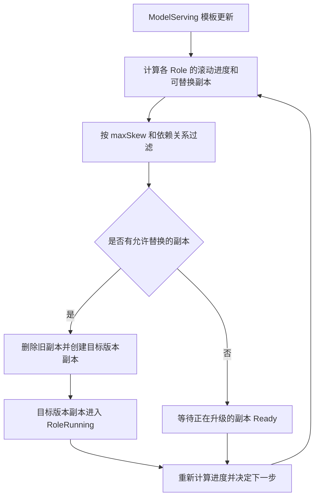
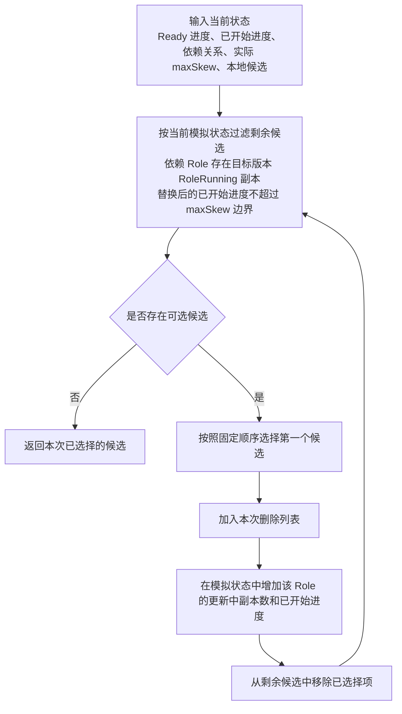

## Role 等比例协调滚动升级

### 摘要

Kthena 已支持 `RoleRollingUpdate`。当前实现能够保证单个 Role 的滚动升级遵守自己的 `partition` 和 `maxUnavailable`，但不同 Role 的滚动决策彼此独立。

当一个 ServingGroup 内存在相互依赖的 Role，例如 A 依赖 B、B 依赖 C 时，独立滚动会产生两个问题：

1. A、B、C 的新版副本比例可能相差很大，导致新版容量不匹配；
2. 新版 A 或 B 可能先于其新版下游依赖 Ready，导致业务请求找不到兼容的下游。

本方案在现有 Role 滚动升级逻辑上增加一层 ServingGroup 内的协调决策：

- 用每个 Role 自身“本次需要升级的副本数”作为分母，计算新版滚动进度；
- 用 `maxSkew` 限制参与协调的 Role 之间最多相差多少个百分点；
- 用用户声明的依赖关系保证下游至少有一个目标版本副本 Ready 后，上游才能开始替换；
- 继续遵守每个 Role 原有的 `partition` 和 `maxUnavailable`。

本文先说明方案运行时的完整流程，再定义进度和约束，最后给出 controller 实现、选择算法和 API 设计。

### 背景

#### 当前 RoleRollingUpdate 如何推进

ModelServing 模板发生变化后，controller 会比较目标模板和当前 Role replica，逐步将旧版本副本替换成新版本副本。现有 Role 滚动升级的主要行为是：

1. 找出模板 hash 不是目标 hash 的旧 Role replica；
2. 按每个 Role 自己的 `partition` 排除受保护副本；
3. 按每个 Role 自己的 `maxUnavailable` 计算本次允许删除多少旧副本；
4. 删除选中的旧 Role replica；
5. 在对应位置创建目标版本副本；
6. entry Pod 和全部 worker Pod 都 RunningAndReady 后，该 Role replica 进入 `RoleRunning`；
7. 重复以上过程，直到本次允许更新的旧副本全部替换完毕。

当前问题发生在选择可删除副本时：每个 Role 独立计算，没有比较同一个 ServingGroup 内所有 Role 的升级进度，也不知道 Role 间的依赖关系。

#### 需要解决的场景

假设一个 ServingGroup 包含：

```text
A 依赖 B
B 依赖 C
```

依赖方向的含义是：新版 A 只访问新版 B，新版 B 只访问新版 C。具体的版本路由由业务实现，Kthena 不负责路由。

如果 controller 同时开始替换 A、B、C 各一个副本，而 A、B 比 C 更快 Ready，就可能形成：

```text
新版 A：Ready
新版 B：Ready
新版 C：未 Ready
```

此时流量进入新版 A 后会继续到新版 B，但新版 B 找不到已经 Ready 的新版 C，请求可能失败。

如果为了规避这个问题而先把 C 全部升级完，再开始 B 和 A，又会造成大量新版 C 长时间没有新版上游流量，且多个 Role 的新版容量比例严重失衡。

所以本需求需要同时解决两个问题：

- **依赖安全**：下游至少存在一个目标版本 Ready 副本，上游才能开始替换；
- **比例协调**：参与滚动的 Role 按各自升级完成百分比推进，Role 之间的进度差保持在用户允许的范围内。

### 目标与非目标

#### 目标

- 在单个 ServingGroup 内协调本次发生模板变化的多个 Role。
- 用百分比而不是绝对副本数比较不同 Role 的升级进度。
- 支持用户通过 `maxSkew` 配置最大进度差，例如 `10%`。
- 支持用户声明滚动升级依赖，下游至少有一个目标版本 `RoleRunning` 副本后解锁上游。
- 保持现有 `partition`、`maxUnavailable`、删除和补建流程。

#### 非目标

- 不实现或校验业务版本路由。
- 不改变 ModelServing 首次创建时的 Role 顺序；依赖只作用于滚动升级。
- 不协调不同 ServingGroup 之间的进度。
- 不替代单 Role 的 `partition` 或 `maxUnavailable`。
- 不设计或实现 Role `maxSurge` 的 API、临时副本创建、命名、额度控制和旧副本回收；本方案只定义底层 `maxSurge` 能力落地后的协调接入规则。
- 不把普通扩缩容、故障恢复、Role 新增或删除当成等比例滚动。
- 不实现自动回滚。
- 不修改 PodReady，不增加 readiness gate，也不改变 Service Endpoint 选择。

### 方案基本流程

#### 一句话说明

现有逻辑先为每个 Role 算出“本次最多可以替换哪些旧副本”，新增的协调逻辑再从这些候选中选择同时满足比例约束和依赖约束的副本，最后沿用现有流程完成删除与补建。

#### 完整流程

下面的“目标版本”指最新 ModelServing 模板对应的 Role 模板 hash；“新版 Ready 副本”指 hash 已经是目标值并且状态为 `RoleRunning` 的 Role replica。

一次模板更新后的完整流程如下：



每一轮协调判断依次做以下事情：

1. **确定协调范围**：找出当前 ServingGroup 中参与协调、且本次确实发生模板变化的 Role。
2. **读取实际状态**：统计每个 Role 已经 Ready 的新版副本，以及已经开始替换但尚未 Ready 的副本。
3. **执行原有单 Role 检查**：应用 `partition` 和 `maxUnavailable`，得到每个 Role 的本地候选。
4. **执行跨 Role 检查**：判断批准一个候选后是否仍满足 `maxSkew`，以及它依赖的每个 Role 是否至少有一个目标版本 Ready 副本。
5. **替换允许的旧副本**：沿用现有删除和补建逻辑，创建目标版本副本。
6. **根据 Ready 状态继续推进**：新副本进入 `RoleRunning` 后重新计算所有 Role 的进度，再决定下一步。

#### A → B → C 的推进示例

假设：

```text
A、B、C 各有 10 个副本
partition 均为 0
maxUnavailable 均为 1
maxSkew = 20%
A dependsOn B
B dependsOn C
```

每个副本代表本 Role 的 10% 滚动进度。整个过程分为启动阶段和比例推进阶段。

**启动阶段**

| 当前 Ready 进度 | controller 的动作 | 动作完成后 | 原因 |
|---|---|---|---|
| A=0%，B=0%，C=0% | 替换 1 个 C | A=0%，B=0%，C=10% | C 没有依赖，可以先启动 |
| A=0%，B=0%，C=10% | 替换 1 个 B | A=0%，B=10%，C=10% | 已存在目标版本 C，B 的依赖条件满足 |
| A=0%，B=10%，C=10% | 替换 1 个 A | A=10%，B=10%，C=10% | 已存在目标版本 B，A 的依赖条件满足 |

至此 A、B、C 都已经启动。依赖关系的作用已经体现：C 解锁 B，B 解锁 A。

**比例推进阶段**

此时最小 Ready 进度为 10%，所以任意 Role 当前最多可以推进到：

```text
10% + maxSkew 20% = 30%
```

假设 A 比 B、C 更快，下面的状态都是允许的：

| A | B | C | 是否允许 | 原因 |
|---:|---:|---:|---|---|
| 20% | 10% | 10% | 允许 | 最大进度差为 10% |
| 30% | 10% | 10% | 允许，但 A 不能继续 | 最大进度差达到 `maxSkew=20%` |
| 40% | 10% | 10% | 不允许 | 最大进度差会达到 30% |

因此依赖解锁后不再要求 `A <= B <= C`。A 可以超过 B，但达到 `maxSkew` 边界后必须等待 B、C 追赶。

这里依赖关系和 `maxSkew` 解决的是不同问题：

- 没有依赖关系时，A、B 可能在目标版本 C Ready 前开始替换；
- 没有 `maxSkew` 时，C 每次 Ready 后都可以继续使用已经释放的 `maxUnavailable`，可能远远领先于 B、A；
- 依赖只负责保证兼容的目标版本下游已经存在，`maxSkew` 负责后续的容量比例；因此依赖解锁后允许 A 在偏差范围内超过 B。

### 详细设计

详细设计只解决一个问题：现有 `RoleRollingUpdate` 选出旧副本后，哪些副本现在可以开始替换。

#### 1. 确定协调范围

协调的最小范围是一个 ServingGroup。同一个 ModelServing 的不同 ServingGroup 分别计算和推进，互不等待。

`roles` 指定参与协调的 Role；不填时表示该 ServingGroup 中的全部 Role。只有本次模板发生变化的 Role 参与 `maxSkew` 计算。模板未变化的 Role 已经处于目标版本，不需要滚动；未被选择的 Role 继续使用原有独立滚动逻辑。

依赖关系的两端必须都在协调范围内。

#### 2. 计算滚动进度和实际 maxSkew

不同 Role 的副本数可能不同，所以比较的是各 Role 完成自身滚动目标的百分比，而不是新版副本数量。

```text
目标副本数 = replicas - partition
Ready 副本数 = 目标范围内，模板 hash 为目标值且状态为 RoleRunning 的副本数
更新中副本数 = 已经开始删除、补建或等待 Ready 的副本数
```

如果底层 Role 滚动升级已经支持 `maxSurge`，已获准创建、正在创建或正在等待 Ready 的目标版本 surge 副本也计入“更新中副本数”。目标副本数仍然使用 `replicas - partition`，不能使用包含临时 surge 副本的实时总数作为分母。

基于这三个数计算两个进度：

```text
Ready 进度  = Ready 副本数 / 目标副本数
已开始进度 = (Ready 副本数 + 更新中副本数) / 目标副本数
```

例如 Role A 的 `replicas=10`、`partition=2`，本次只更新 8 个副本。当前其中 2 个已经是新版 Ready，1 个正在更新，另外 5 个仍是旧版：

- 目标副本数：`10 - 2 = 8`；
- Ready 进度：`2 / 8 = 25%`；
- 已开始进度：`(2 + 1) / 8 = 37.5%`。

Ready 进度表示真实可用的新版容量；已开始进度还包含尚未 Ready 的更新。候选判断使用已开始进度，避免一个正在创建的副本尚未 Ready 时又继续启动过多更新。

进度最终要落到整数副本，因此还要计算实际可执行的 `maxSkew`：

```text
实际 maxSkew = max(用户配置的 maxSkew, 所有滚动 Role 中最大的单副本进度)
```

例如用户配置 `maxSkew=10%`，A、B、C 本次分别需要更新 8、4、10 个副本：

- A 的单副本进度：`1 / 8 = 12.5%`；
- B 的单副本进度：`1 / 4 = 25%`；
- C 的单副本进度：`1 / 10 = 10%`；
- 最大单副本进度是 25%，因此实际 `maxSkew=max(10%, 25%)=25%`。

B 一次最少前进 25%，所以本次实际 `maxSkew` 必须放宽到 25%，否则 B 无法更新任何副本。发生放宽时，controller 通过 Condition 和 metric 暴露实际值。

#### 3. 判断候选是否可以替换

现有逻辑先使用 `partition` 和 `maxUnavailable` 找出每个 Role 当前可以替换的旧副本。协调逻辑只负责继续过滤，不会扩大原有删除额度。

对 Role r 的一个候选，先计算替换它以后 r 的“下一步进度”：

```text
下一步进度 = (Ready 副本数 + 更新中副本数 + 1) / 目标副本数
```

候选必须同时通过两个条件：

```text
依赖条件：每个依赖 Role 至少有 1 个目标版本 RoleRunning 副本
比例条件：下一步进度 <= 所有滚动 Role 的最小 Ready 进度 + maxSkew
```

依赖条件只保证目标版本下游已经真实存在，不要求上游进度始终小于下游；比例条件负责保证任何 Role 都不会与当前最慢 Role 拉开过大的进度差。不同 Role 的副本数不同时仍比较百分比，不要求相同 ordinal。

例如 `A dependsOn B`，只要 B 至少有一个目标版本副本进入 `RoleRunning`，A 就通过依赖检查。之后即使 A 的进度超过 B，只要整体进度差仍满足 `maxSkew`，A 仍可以继续滚动。B 只是创建出来但尚未进入 `RoleRunning`，不能解锁 A。

### 算法与 Controller 实现

#### 改动边界

`syncModelServing` 的总体 reconcile 流程保持不变：

```text
1. 对齐 ServingGroup 数量
2. 对齐各 ServingGroup 中的 Role 副本和缺失 Pod
3. manageRollingUpdate
4. 对齐 Service
5. 更新 Status
```

本方案只改变 `manageRollingUpdate` 中 `RoleRollingUpdate` 的“选择哪些旧 Role replica 可以删除”这一决策，不重写以下执行路径：

- `DeleteRole`；
- 删除完成后的 datastore 清理；
- `syncRoleReplicas` 补建；
- Pod Ready 后更新 `RoleRunning`；
- ControllerRevision 和 RoleTemplateHash 处理；
- workqueue 的错误重试。

为了避免协调逻辑与资源操作混在一起，建议把跨 Role 决策实现为纯计算模块。它只接收一次 reconcile 的状态快照和原有逻辑给出的本地候选，返回最终允许删除的候选及阻塞原因。

#### 构建算法输入

对每个非 Deleting 的 ServingGroup，依次完成：

1. 根据 API 得到最终参与协调的 Role 集合和依赖图；
2. 计算每个 Role 的目标模板 hash；
3. 解析 `replicas` 和 `partition`，确定本次滚动目标位置；
4. 扫描现有 Role replica，将其分类为旧版、新版未 Ready、新版 Ready、正在删除或缺失；
5. 计算每个 Role 的目标副本数、Ready 数和在途数；
6. 计算 Ready 进度、已开始进度和实际 `maxSkew`；
7. 调用现有 Role 级逻辑，根据 `partition` 和 `maxUnavailable` 生成本地候选。

如果参与 Role 正在进行普通扩缩容，先由现有 scaling 流程完成扩缩容，本次暂停协调删除。否则扩容产生的缺失副本和滚动删除产生的缺失副本可能被重复统计。

#### 完整选择算法

输入的本地候选已经通过各 Role 自己的 `partition` 和 `maxUnavailable`。协调器只增加依赖和 `maxSkew` 两层限制，因此只能减少删除数量，不能扩大原有额度。



同一次 reconcile 中“选一个、立即增加在途数、再选下一个”非常重要。informer 不会在 `DeleteRole` 调用后立刻反映新状态，如果一次性使用旧快照判断全部候选，可能连续批准多个原本只应该批准一个的副本。

#### 候选选择顺序

多个候选同时满足条件时，使用以下固定顺序，保证同一输入得到同一结果：

1. 已开始进度较低的 Role 优先；
2. 进度相同时，按 Role 在 spec 中的声明顺序；
3. 同一 Role 内沿用现有习惯，ordinal 从大到小。

依赖关系只参与候选是否可选的判断，不在解锁后继续影响候选优先级。

#### 执行删除和补建

协调器返回候选后，继续调用现有 `DeleteRole`：

1. 将旧 Role replica 标记为 `RoleDeleting`；
2. 删除其 entry/worker Pods 和 Service；
3. 删除完成后由现有 handler 清理 datastore 并再次入队；
4. 下一次 reconcile 由 `syncRoleReplicas` 在缺失位置创建目标版本 Role replica。

从旧副本开始删除，到新副本进入 `RoleRunning` 之前，这个位置始终计入在途数，同时占用：

- 本 Role 的 `maxUnavailable` 额度；
- 跨 Role 的比例额度。

#### 由 Ready 事件继续推进

一个 Role replica 只有在 entry Pod 和全部 worker Pod 都 RunningAndReady 后，才会进入 `RoleRunning`。本方案将这个既有状态作为“新版 Ready”的唯一判断标准。

需要保证：参与协调的任意 Role replica 从非 `RoleRunning` 转为 `RoleRunning` 时，都重新 enqueue 所属 ModelServing。不能等整个 ServingGroup 都 Running，因为依赖 Role 的第一个目标版本副本 Ready 就可能解锁上游，后续 Ready 变化也会释放新的 `maxSkew` 额度。

事件链为：

```text
reconcile 批准并删除旧副本
  → 删除事件入队
  → reconcile 补建目标版本副本
  → Pod Ready，Role 进入 RoleRunning，并再次入队
  → reconcile 重新计算全部 Role 的进度并决定下一步
```

#### 状态恢复和幂等性

每次 reconcile 都以当前资源状态作为算法输入。以下事实都能从现有对象得到：

- Role replica 的模板 hash；
- `RoleRunning` 状态；
- `RoleDeleting` 状态；
- 目标范围内缺失的副本位置；
- 最新 ModelServing spec 和依赖配置。

因此无论是正常的重复 reconcile，还是 controller 在删除中、创建中或等待 Ready 时重启，都能重新识别已经开始的更新，避免将同一个副本位置再次作为新工作批准。

#### 建议的代码结构

```go
type RoleProgress struct {
    TargetReplicas  int32
    UpdatedReady    int32
    InFlight        int32
}

type RoleRolloutSnapshot struct {
    GroupName       string
    TargetRevision  string
    Roles           map[string]RoleProgress
    Dependencies    DependencyGraph
    ConfiguredSkew  int32 // basis points
    EffectiveSkew   int32 // basis points
}

type RoleRolloutCoordinator interface {
    Select(
        snapshot RoleRolloutSnapshot,
        localCandidates []RoleCandidate,
    ) Decision
}

type Decision struct {
    Candidates []RoleCandidate
    Blocked    []BlockedReason
}
```

主要代码改动：

1. API types、CRD 和 generated deepcopy/client；
2. ModelServing webhook 校验和 warning；
3. `rolesToDeleteForRoleRollingUpdate` 先收集所有 Role 的本地候选，再统一协调；
4. `outdatedRoles` 及 helper 补充新版 Ready、在途和缺失位置分类；
5. `handleReadyPod` 在参与 Role 进入 `RoleRunning` 时及时 enqueue；
6. Condition、Event 和 metrics。

进度和候选选择函数应尽量保持为无副作用的纯函数，便于通过表格测试和 fuzz 测试验证算法。

### API 设计

#### YAML 示例

协调能力为可选能力，只能用于 `RoleRollingUpdate`：

```yaml
apiVersion: workload.serving.volcano.sh/v1alpha1
kind: ModelServing
metadata:
  name: example
spec:
  rolloutStrategy:
    type: RoleRollingUpdate
    roleRollingUpdateConfiguration:
      coordination:
        # 可选；不填或为空表示模板中的全部 Role。
        roles: [a, b, c]

        # 必填；各 Role 滚动进度允许相差的最大百分点。
        maxSkew: 10%

        # 可选；只影响滚动升级，不影响首次创建。
        # a dependsOn b 表示 b 至少有一个目标版本副本 RoleRunning 后，a 才能开始滚动。
        dependencies:
        - role: a
          dependsOn: [b]
        - role: b
          dependsOn: [c]

  template:
    roles:
    - name: a
      replicas: 4
      maxUnavailable: 1
      partition: 0
      # 省略模板
    - name: b
      replicas: 4
      maxUnavailable: 1
      partition: 0
    - name: c
      replicas: 4
      maxUnavailable: 1
      partition: 0
```

字段语义：

- `coordination`：出现该字段才启用跨 Role 协调；不配置时保持原有行为。
- `roles`：定义参与协调的 Role；省略或空列表表示模板中的全部 Role。
- `maxSkew`：参与 Role 允许的最大滚动进度百分点差，只接受百分比。
- `dependencies`：滚动升级启动依赖；`role: a, dependsOn: [b]` 表示 B 至少有一个目标版本 `RoleRunning` 副本后，A 才能开始滚动。解锁后不要求 A 的进度一直小于 B。

不增加 Ready/Scheduled 模式开关。依赖条件固定检查目标版本 `RoleRunning` 副本是否存在，后续比例只由 `maxSkew` 控制。

#### Go API

```go
type RoleRollingUpdateConfiguration struct {
    Coordination *RoleRollingUpdateCoordination `json:"coordination,omitempty"`
}

type RoleRollingUpdateCoordination struct {
    // 空表示全部 Role。
    Roles []string `json:"roles,omitempty"`

    // 必填，只允许 "10%" 形式的百分比字符串。
    MaxSkew *intstr.IntOrString `json:"maxSkew"`

    Dependencies []RoleRolloutDependency `json:"dependencies,omitempty"`
}

type RoleRolloutDependency struct {
    Role      string   `json:"role"`
    DependsOn []string `json:"dependsOn"`
}
```

#### API 校验

Webhook 应校验：

- `roleRollingUpdateConfiguration` 和 `coordination` 只能配合 `RoleRollingUpdate` 使用；
- 配置 `coordination` 时必须填写 `maxSkew`；
- `maxSkew` 只能是 `(0%, 100%]` 的百分比字符串，拒绝整数副本数；
- `roles` 中的名称必须存在且不能重复；
- dependencies 的 `role` 和 `dependsOn` 必须存在、不能重复，且都在最终协调集合中；
- 禁止 Role 依赖自身；
- 依赖图必须无环；
- 最终协调集合至少包含两个 Role；
- 每个 Role 解析后的 partition 不能大于 replicas。

未填写 `maxUnavailable` 时，现有 Role 滚动逻辑可能一次允许删除全部旧副本。`maxSkew` 只能限制不同 Role 的相对进度，不能替代单 Role 可用性保护，因此 webhook 应对参与协调但未配置 `maxUnavailable` 的 Role 返回 warning。

### 与现有能力的关系

#### maxUnavailable

`maxUnavailable` 继续回答“这个 Role 当前最多允许有多少不可用副本”。新增协调逻辑回答“即使本 Role 还有可用性额度，跨 Role 来看现在是否允许使用这份额度”。

协调逻辑只能收紧，不能扩大 `maxUnavailable` 给出的删除数量。

#### partition

每个 Role 的 partition 独立生效，只改变自己的滚动目标和进度分母，不会传播给其他 Role。

例如：

```text
A: replicas=4, partition=2  → 本次更新 2 个
B: replicas=4, partition=0  → 本次更新 4 个
C: replicas=4, partition=0  → 本次更新 4 个
```

A 的两个目标副本都新版 Ready 后，A 的本次进度就是 100%，并保留另外两个旧副本；B、C 仍分别更新全部四个副本。

如果一个发生模板变化、且被上游依赖的 Role 因 partition 导致本次目标副本数为 0，它无法产生目标版本 Ready 副本。上游无法通过依赖启动门控，并报告 `DependencyHasNoEligibleReplica`。

#### maxSurge 适配边界

本方案不负责实现 Role `maxSurge`。底层能力落地后，协调逻辑只需要接入以下约定：

1. 底层 Role 滚动逻辑负责判断 surge 额度、创建临时副本、处理名称或 ordinal，并在新版 Ready 后删除旧副本。
2. 在创建一个目标版本 surge 副本前，底层逻辑将这次创建作为滚动候选交给协调器检查依赖条件和 `maxSkew`。
3. surge 创建一经批准，就计入更新中副本数并占用已开始进度，避免其他 Role 或下一次 reconcile 重复使用这份比例额度。
4. surge 副本进入 `RoleRunning` 后，从更新中副本转为 Ready 副本，可以释放新的 `maxSkew` 额度，也可以满足其他 Role 的依赖启动条件。
5. 随后删除旧副本不会再次增加滚动进度，因为对应新版副本已经在创建和 Ready 阶段计数。

`coordination` API 不需要因为 `maxSurge` 增加字段。实现上的前提是底层 `maxSurge` 能够向协调器暴露“准备创建一个目标版本副本”的候选，并提供足够的标签或状态，使 controller 重启后仍能识别该 surge 副本属于本次滚动。

#### RecoveryPolicy

主动滚动删除继续通过 `RoleDeleting` 与运行时故障区分。已经完成一部分滚动后发生新的 Pod 故障，仍由现有 RecoveryPolicy 处理。本方案不会因为下游后来故障而主动撤回已经 Ready 的上游副本。

#### 滚动中再次修改模板

最新 ModelServing spec 始终是目标状态。模板再次变化并产生新的目标 hash 后，controller 按新目标重新分类旧版、新版 Ready 和在途副本，并基于新的目标版本重新执行协调判断。

### 阻塞与异常处理

#### 下游新副本长时间不 Ready

例如新版 C 一直处于 Creating：

- C 的这份工作持续占用本 Role `maxUnavailable` 和跨 Role 比例额度；
- B 因 C 尚无目标版本 Ready 副本而不能开始替换；
- A 因 B 尚无目标版本 Ready 副本也不能开始；
- 旧 A、B 继续运行；
- C 恢复 Ready 后，事件重新入队并继续滚动。

这是符合设计的安全停顿，不是 controller 内部死锁。

#### 新副本无法调度

无法调度的新副本保持在途，不释放预算。Scheduler 事件用于解释资源不足，Kthena Condition 表示正在等待新版 Role Ready。

#### 运行时故障造成已观察进度回退

正常滚动过程中，Ready 进度只会上升。但如果已 Ready 的新版副本后来发生故障，某个 Role 的 Ready 进度可能下降，使当前实际状态暂时超过 `maxSkew`，或者使依赖 Role 的目标版本 Ready 副本数降为 0。

controller 不回滚已经完成的副本，也不伪造 Ready 状态；它停止批准会继续扩大偏差的候选。依赖 Role 没有目标版本 Ready 副本时，也停止批准其上游的新候选，等待 RecoveryPolicy 恢复容量，并通过 Condition/Event 暴露原因。

#### 旧资源缺少模板 hash

优先使用现有 ControllerRevision 回退逻辑推导 Role 模板 hash。若仍无法确定，保守地将该副本视为未满足目标版本 Ready，并报告 hash unresolved。

#### 同时发生普通扩缩容

当参与 Role 的实际副本数尚未收敛到最新 spec 时，暂停该 ServingGroup 的协调删除，先完成普通扩缩容，避免同一个缺失位置同时被解释为扩容和滚动替换。

### 状态与可观测性

第一版复用 `ModelServing.status.conditions` 表示总体状态，不在 Status 中写入完整的 ServingGroup × Role 明细矩阵。

建议的 Condition Reason：

- `CoordinatedRoleRolloutProgressing`
- `WaitingForDependencyReady`
- `WaitingForSkewBudget`
- `WaitingForRoleAvailability`
- `WaitingForRoleScaling`
- `DependencyHasNoEligibleReplica`
- `ReplicaGranularityRelaxedSkew`
- `ObservedProgressRegressed`

事件只在阻塞原因变化时发送或进行限频，避免每次 reconcile 重复产生相同事件。

建议指标：

```text
kthena_modelserving_role_rollout_ready_progress_ratio
kthena_modelserving_role_rollout_started_progress_ratio
kthena_modelserving_role_rollout_target_replicas
kthena_modelserving_role_rollout_updated_ready_replicas
kthena_modelserving_role_rollout_inflight_replicas
kthena_modelserving_role_rollout_configured_max_skew_ratio
kthena_modelserving_role_rollout_effective_max_skew_ratio
kthena_modelserving_role_rollout_blocked
```

标签至少包含 namespace、ModelServing、ServingGroup、Role 和 target revision。需要评估 ServingGroup 数量，避免指标基数失控。

现有 `status.updatedReplicas` 是 ServingGroup 粒度，不能直接作为 Role 的滚动进度。若未来需要在 CR Status 中展示 Role 明细，应先评估对象大小，再决定是否增加按 Role 聚合状态。

### 测试方案

#### 单元测试

- `roles` 省略时选择全部 Role，显式配置时只选择子集；
- `maxSkew` 百分比解析，拒绝整数和非法范围；
- dependency 不存在、重复、自依赖和环检测；
- 目标 hash 且 `RoleRunning` 的新版 Ready 计数；
- Deleting、新版未 Ready 和缺失位置的在途计数；
- 每个 Role 独立应用 partition 并计算目标副本数；
- 未发生模板变化的选中 Role 不阻塞滚动；
- 被依赖 Role 的目标副本数为 0 时阻塞上游；
- 相同和不同副本数下的比例计算与单副本粒度放宽；
- 依赖 Role 没有目标版本 `RoleRunning` 副本时不允许上游候选；
- 依赖存在目标版本 `RoleRunning` 副本后，允许上游在 `maxSkew` 范围内超过下游进度；
- 依赖 Role 的目标版本 Ready 副本数重新降为 0 时，停止批准新的上游候选；
- 同一次 reconcile 每批准一个候选后立即计入在途，不能超发；
- 协调结果不突破现有 `maxUnavailable`；
- 相同输入得到相同候选顺序；
- controller 重启前后，相同对象状态得到相同决策。

#### Property/Fuzz 测试

随机生成无环依赖图、replicas、partition、Ready 状态和本地预算，验证：

- 所有选中候选都满足 partition 和本地 availability；
- 每次批准后的进度不突破实际 `maxSkew`；
- 每个上游候选获批时，其所有依赖都至少有一个目标版本 `RoleRunning` 副本；
- 同一个快照的决策是确定的；
- 当所有创建最终都能 Ready 时，反复 reconcile 最终完成；
- 非法依赖图一定被拒绝。

#### Integration 测试

- ModelServing Spec Update 事件入队并触发协调选择；
- Pod/Service 删除过程中在途计数不丢失；
- 任意参与 Role 进入 `RoleRunning` 都能及时重新入队；
- workqueue 重试不会产生重复删除；
- controller 在 Deleting、Creating 和等待 Ready 阶段重启后能恢复；
- 滚动过程中再次修改模板能切换到新的目标 hash。

#### E2E 测试

- A/B/C 副本数相同，故意延迟 C Ready，验证 B、A 不提前启动；
- 依赖完成启动解锁后，验证 A 可以在 `maxSkew` 范围内超过 B；
- A/B/C 副本数不同，验证按百分比而非副本数推进；
- `maxSkew` 小于最大单副本步长，验证放宽和可观测性；
- A 使用 partition 保留部分旧版，B/C 完整更新；
- C 无法调度时，上游停止且旧容量保留；
- 显式 Role 子集只协调选中的 Role；
- 运行时故障造成 Ready 进度下降时停止批准新工作；
- Role `maxSurge` 落地后，验证 surge 获批即计入更新中、进入 `RoleRunning` 后转为 Ready、删除对应旧副本时不重复增加进度。

### 发布计划

1. 在 `CoordinatedRoleRollingUpdate` feature gate 后增加 alpha API。
2. 首先落地 webhook、状态统计、纯计算协调器和 dry-run 日志/metrics。
3. 单元测试和 integration 测试稳定后启用真实候选过滤。
4. 增加注入 Ready 延迟、调度失败和 controller 重启的 E2E。
5. 验证长期阻塞、进度粒度和性能后，再决定 feature gate 的默认值。

feature gate 关闭或未配置 `coordination` 时，行为与现有 `RoleRollingUpdate` 完全一致。

### 备选方案

#### 只依赖业务版本路由

不采用。版本路由只能在已经存在的兼容端点中选择；新版 C 尚未 Ready 时，业务路由无法凭空提供新版 C。

#### 只使用依赖启动门控

不采用。启动门控只能保证新版下游先存在；解锁后若没有 `maxSkew`，任意 Role 都可能远远领先，仍然无法保证新版容量比例。

#### 只使用 maxSkew，同时启动 A/B/C

不采用。初始三者进度都是 0，如果同时批准各一个，A/B 可能先于 C Ready。比例接近不能替代依赖 Ready 条件。

#### 使用副本数量差作为 maxSkew

不采用。相差一个副本，对于 2 副本 Role 是 50%，对于 100 副本 Role 只有 1%，无法表达等比例升级。

#### 在依赖 Ready 前将上游 Pod 强制标为 NotReady

不采用。该做法会把滚动决策耦合到 kubelet readiness 和 Service Endpoint，并需要处理下游故障时是否反向下线已经 Ready 的上游。直接在删除旧上游副本前阻止候选更简单。

### 参考

- [Kthena Role rolling update proposal](https://github.com/volcano-sh/kthena/blob/main/docs/proposal/role-rollingupdate.md)
